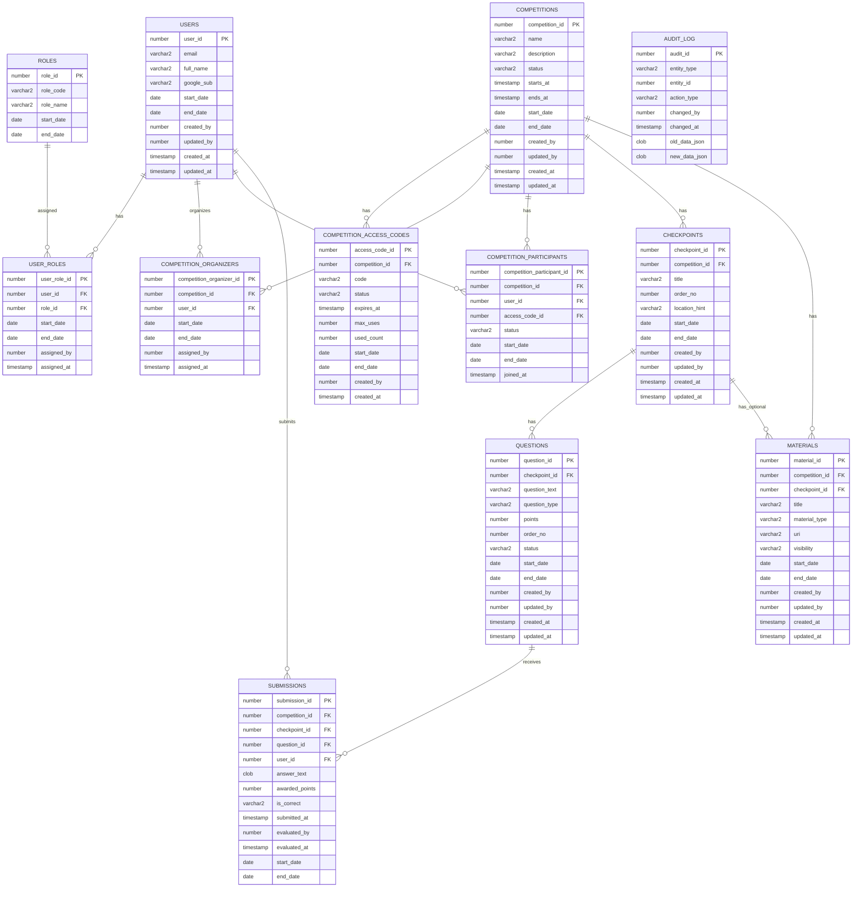

# Andmemudeli ERD (v2)

Allolev ERD arvestab rolle, ORDS-protseduuripõhist backendi, audit-logi ja ajalisi kirjeid (`start_date`, `end_date`).

## Aktiivse kirje reegel

Aktiivne kirje on kirje, kus:
- `end_date IS NULL` **või**
- `end_date > SYSDATE`

See reegel kehtib kõigis ärireeglites, kus kontrollitakse unikaalsust või kehtivust.

## ERD

## Ärireeglid (kokkuvõte)

1. Füüsilist kustutamist ei tehta; kirje "kustutamine" tähendab `end_date` täitmist.
2. Aktiivne kirje: `end_date IS NULL OR end_date > SYSDATE`.
3. Sama isik võib samal võistlusel olla korraga nii korraldaja kui osaleja.
4. Osaleja topeltliitumine samale võistlusele on keelatud aktiivsete kirjete lõikes.
5. Korraldaja topeltmääramine samale võistlusele on keelatud aktiivsete kirjete lõikes.
6. Võistlusega liitumine toimub koodi alusel; võistlustel on erinevad koodid.
