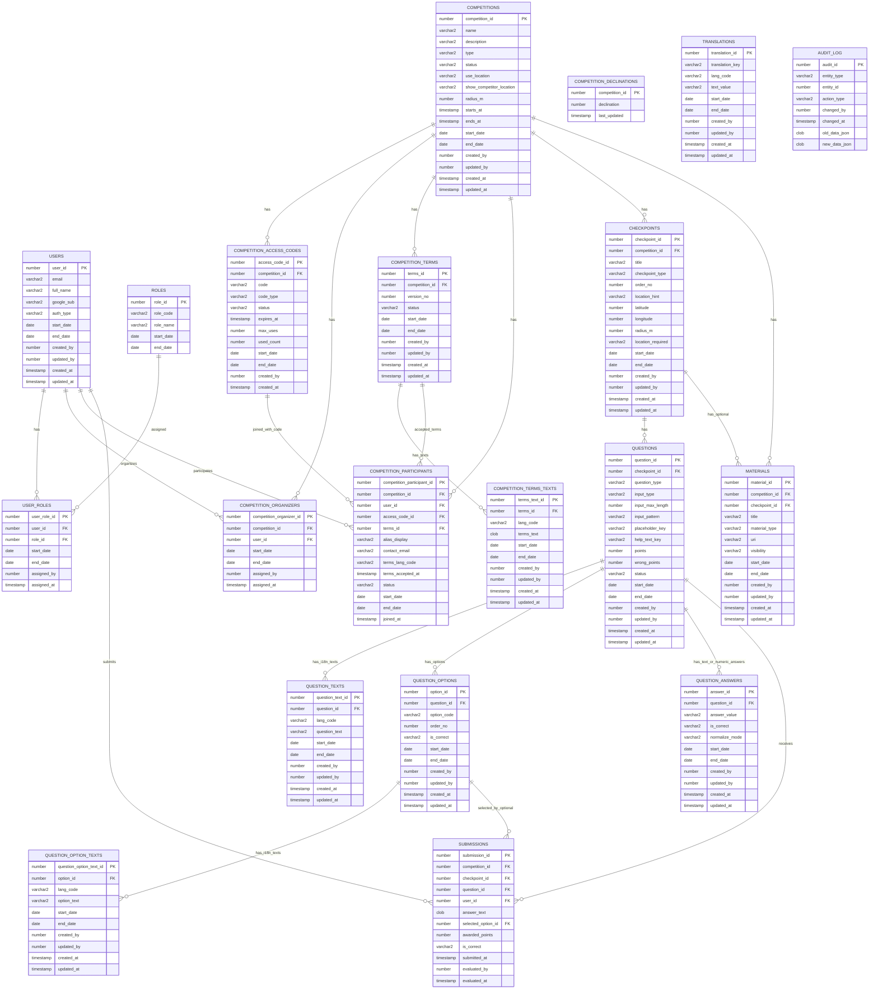

# Andmemudeli ERD (v4)

## Aktiivse kirje reegel

Aktiivne kirje on kirje, kus:
- `end_date IS NULL` voi
- `end_date > SYSDATE`

Märkus: `submissions` tabelis soft-delete veerge (`start_date`, `end_date`) ei ole.

## ERD (Mermaid allikas)

## CHECKPOINTS märkused

- `checkpoint_type` lubatud äriväärtused on `NORMAL`, `START`, `FINISH`.
- Kui `checkpoint_type` on `NULL`, käsitletakse seda rakenduse äriloogikas kui `NORMAL`.
- Ühel aktiivsel võistlusel võib olla maksimaalselt üks aktiivne `START` ja üks aktiivne `FINISH`.
